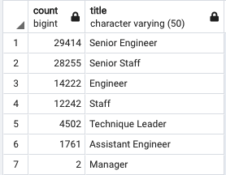
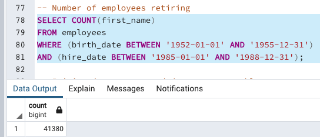

# Pewlett Hackard Analysis

## Overview of the Analysis

For this assignment, we were introduced to Structured Query Language (SQL) and PostgreSQL interface, where SQL can be used. PostgreSQL was used to create databases and pgAdmin was used to work with the data imported. Through Postgres, we were able to create database designs known as Entity Relationship Diagrams. 

This Database system enabled table management and writing SQL statements in order to explore and manipulate data. SQL is not a programming language as one may think; It is a query language. The difference is that programming languages, such as Python, tells data how to act and SQL ask questions of the data. 
 
 ## Analysis

The main goal of the assignment was to ask questions about the data and discover relationships between data tables using relational databases. SQL, Postgres, and pgAdmin were the suitable tools for this project.

The mock company for this project was looking to offer retirement packages for the employees that met certain criteria. Additionally, it was looking into which positions needed to be filled in the near future. Because so many employees were retiring, the company needed to prepare for the thousands of job vacancies.

Six CSV files were provided for this project. The files contained information about departments, employees, managers, salaries, and employees titles. Our job entailed creating queries to access of all the data. Common errors were also handled in the process. For example, we were able to pinpoint employees who may not work for the company anymore, duplicate name entries due to promotions, and the numbers of managers for departments. 

## Results

At the end of the analysis, the mock company was provided with the following:

- Narrow search for retirement eligibility
- A specific number of employees retiring by title
- A meticulously crafted database foundation filled with data
- A comprehensive list of employees eligible for its planned mentorship program

In conclusion, the number of retirement-eligible employees was massive. The findings showed that over 30,000 will be eligible to retire. Furthermore, these employees will become eligible to retire around the same time. 

There were 1550 employees eligible for the mentorship program. Out of 300 thousand plus employees, the average yearly salary was $52,970. It was also interesting to note that there were a small number of managers. 

In order to fill the staggering vacancies they face in the future, they may need to adjust their salaries to attract new talent, and also keep their existing talent. Adjusting the salaries may prevent future costly turnovers.

## Fig. 1

### Retiring Employee Count by Title

## Fig 2

### Sum of Retirement Eligible Employees (before the analysis)

