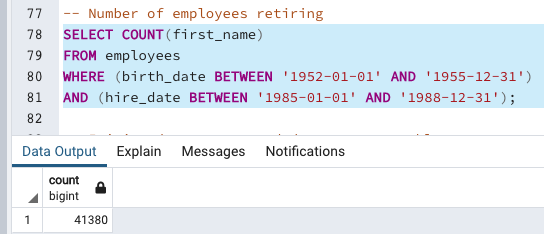
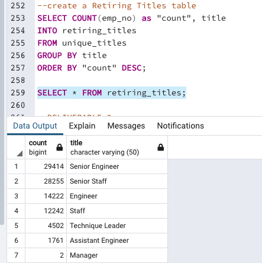
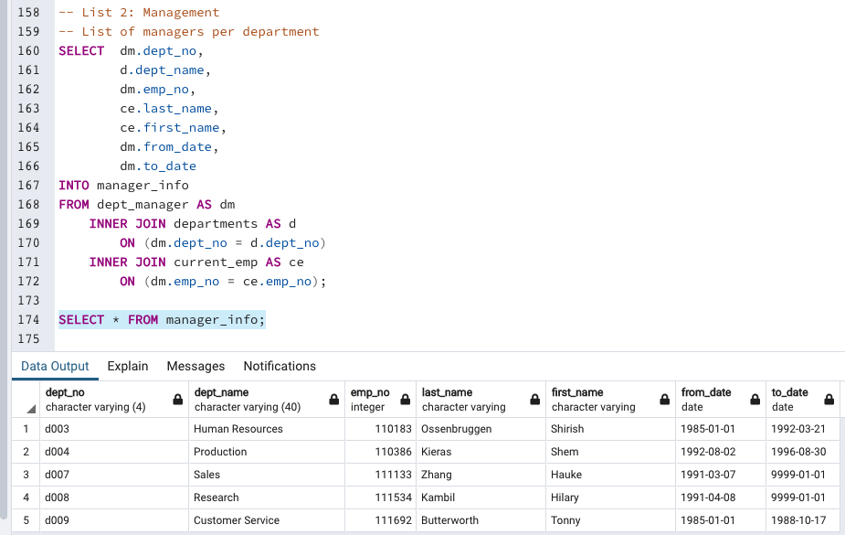
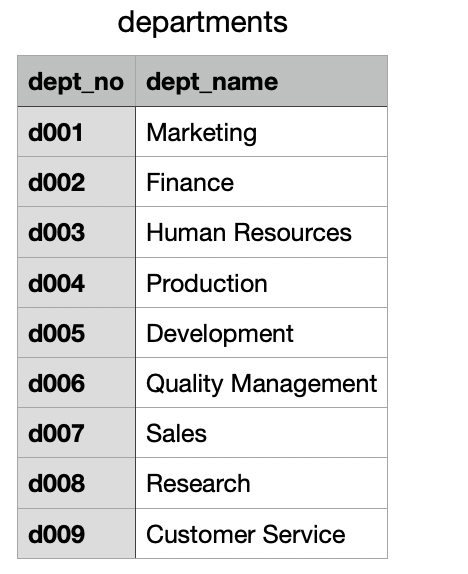

# Pewlett Hackard Analysis

## Overview of the Analysis

For this assignment, we were introduced to Structured Query Language (SQL) and PostgreSQL interface, where SQL can be used. PostgreSQL was used to create databases and pgAdmin was used to work with the data imported. Through Postgres, we were able to create database designs known as Entity Relationship Diagrams. 

The main goal of the assignment was to ask questions about the data and discover relationships between data tables using relational databases. SQL, Postgres, and pgAdmin were the suitable tools for this project.

The mock company for this project was looking to offer retirement packages for the employees that met certain criteria. Additionally, it was looking into which positions needed to be filled in the near future. Because so many employees were retiring, the company needed to prepare for the thousands of job vacancies.

Six CSV files were provided for this project. The files contained information about departments, employees, department employees, department managers, salaries, and employees titles. Our job entailed creating queries to access of all the data. Common errors were also handled in the process. For example, we were able to pinpoint duplicate name entries. The errors were the result of outdated records of employees who no longer work for the company and duplicate name entries due to promotions. 

## Results

The beginning of the analysis showed that there were 300,025 employees listed on the company's record. We then counted the employees eligible for retirement out of that list, and the result found 41,380 eligible employees. After the employees' list was updated by counting current employees, it showed that 36,619 were eligible for retirement.

However, after performing further analysis, it was found that the number of employees eligible for retirement by titles was more that double (90,398). It was also interesting to note that there were five listed managers for nine departments. At the end of the analysis, the mock company was provided with the following:

- Narrow search for retirement eligibility
- A specific number of employees retiring by title
- A meticulously crafted database foundation filled with data
- A comprehensive list of employees eligible for its planned mentorship program

## Fig 1

### Sum of Retirement-Eligible Employees (before analysis)

## Fig. 2

### Retiring Employee Count by Title (after analysis)

## Fig. 3

### List of Existing Managers by Departments

## Fig. 4

### List of Total Departments

## Summary

In conclusion, the number of retirement-eligible employees was massive. The findings showed that over 90,000 will be eligible to retire in the company's near future. Furthermore, these employees will become eligible to retire around the same time. 

The company is also lacking management positions. There were five listed department managers for nine departments. A good question to ask the company is why there were no managers for the Marketing, Finance, and Development departments. Because these departments are vital in all organizations, this potential issue should be addressed accordingly.

Out of 300 thousand plus employees, the average yearly salary was $52,970. 
In order to fill the staggering vacancies they face in the future, they may need to adjust their salaries to attract new talent, and also keep their existing talent. Adjusting the salaries may prevent future costly turnovers. Finally, there are 1,549 employees eligible for the mentorship program. The company will need additional staff to accomplish the success of the planned program.

## Fig. 5

### Total Count Eligible for Mentorship Program
