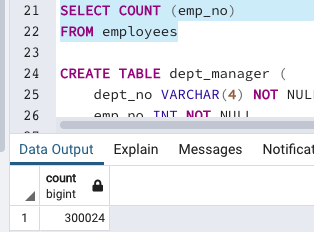
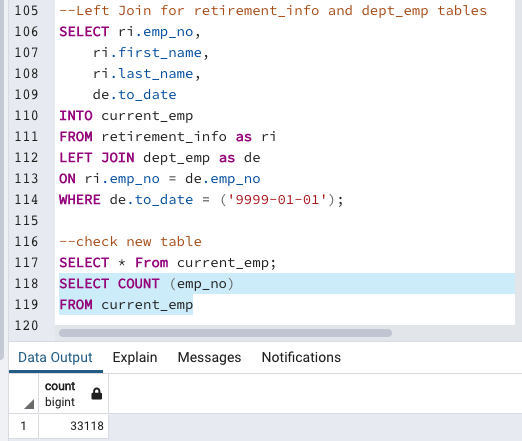
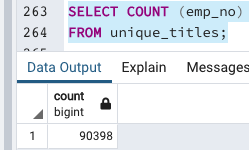
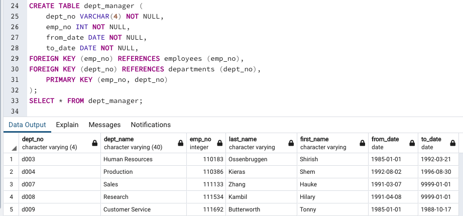
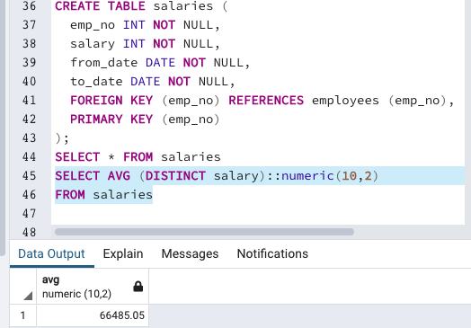
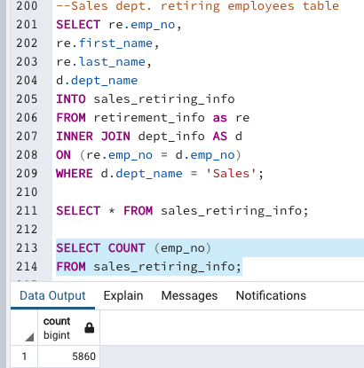
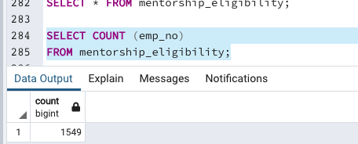
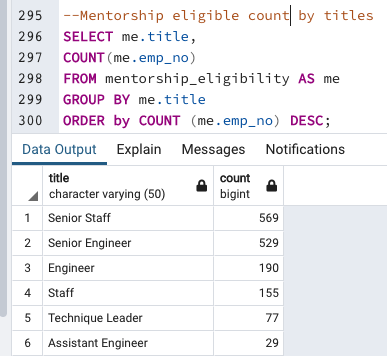
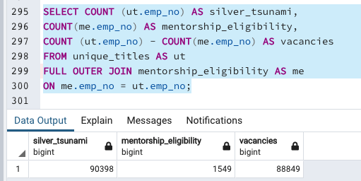

# Pewlett Hackard Analysis

## Overview of the Analysis

For this assignment, entity relationship diagrams were created, data modeling was performed, and an analysis on an employee database using SQL techniques was completed. The goal was to ask questions about the data and discover relationships between data tables using relational databases.

Six CSV files were provided for this project. The files contained information about departments, employees, department employees, department managers, salaries, and employees titles. An ERD was designed was applied to the data. A SQL database was created and large CSV datasets were imported and exported into pgAdmin. The task entailed writing SQL statements to access and analyze the data. 

## Purpose

A hypothetical organization was looking to offer retirement packages for their employees who met certain criteria. Additionally, it was looking into which positions needed to be filled as a result of an expected "silver tsunami". The analysis was focused on determining the number of retiring employees by title, and identify employees who were eligible (based on their criteria) to partake in their planned mentorship program.

## Results

The beginning of the analysis showed 300,025 employees listed on the company's record. Out of that list, employees eligible for retirement (born between 1952 and 1955) were counted. The result found 41,380 eligible employees. Due to the staggering number of retirement-ready employees, the list was broken down by departments in order to find employees who were no longer with the company. After the employees' list was updated by counting current employees, it showed that 33,118 were eligible for retirement.

However, after performing further analysis, it was found that the number of employees eligible for retirement was 90,398 (triple the amount of original number). It was also interesting to note that there were five listed managers for nine departments. At the end of the analysis, Pewlett-Hackard was provided with the following:

- Narrow search for retirement eligibility
- A specific number of employees retiring by title
- A meticulously crafted database foundation filled with data
- A comprehensive list of employees eligible for its planned mentorship program

## Fig.1

### Employees Listed on Records

## Fig.2

### Count of Retirement-Eligible Employees (unfiltered list)

## Fig.3

### Count of Current Retirement-Ready Employees (after filter)

## Fig.4

### Retiring Employee Count by Title (after analysis)

 
 ## Fig.5

### Count of Fig.4

## Fig.6 

### List of Existing Managers by Departments

## Fig.7

### List of Total Departments

## Summary and Recommendations

In conclusion, the number of retirement-eligible employees was massive. The findings showed that over 90,000 will be eligible to retire in the company's near future. Furthermore, these employees will become eligible to retire around the same time. 

The company is also lacking management positions. There were five listed department managers for nine departments. A good question to ask the company is why there were no managers for the Marketing, Finance, Quality Management, and Development departments. 

Out of 300 thousand plus employees, the average yearly salary was $66,485. This number seems rather low considering the amount of senior level positions in the company. However, the location of the company was not given in the dataset, which might have explained the average salary. In order to fill the staggering vacancies they face in the future, the company may need to adjust their salaries to attract new talent, and also keep their existing talent. Adjusting the salaries may prevent future costly turnovers. 

Further, there were 1,549 employees eligible for the mentorship program. The company will need additional staff to accomplish the success of the planned program. A more comprehensive analysis is needed to determine ages of existing employees. The current age bracket to qualify for the mentorship program should be lowered in order to enable younger talent to participate in the program. Our findings showed that 1,549 employees are eligible for the mentorship program, but 90,398 are retiring, which leaves 88,849 open vacancies without mentors.

The analysis also showed that 5,800 employees are retiring from the Sales Department. The largest group of employees retiring by titles were Senior Engineers (29,414), followed by Senior Staff (28,255).

## Fig.8

### Average Salary

## Fig.9

## Retiring Sales Dept.

## Fig.10

### Total Count Eligible for Mentorship Program

## Fig.11 

### Total Count Eligible for Mentorship Program by Title

## Fig.11a

### Versus Retiring by Same Titles

## Fig.12

### Difference Between Retiring Employees & Mentors

